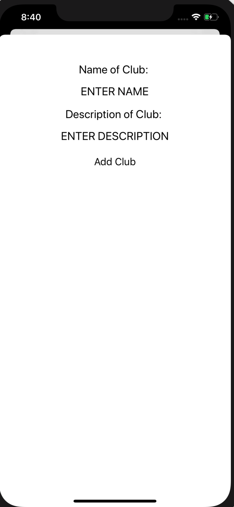
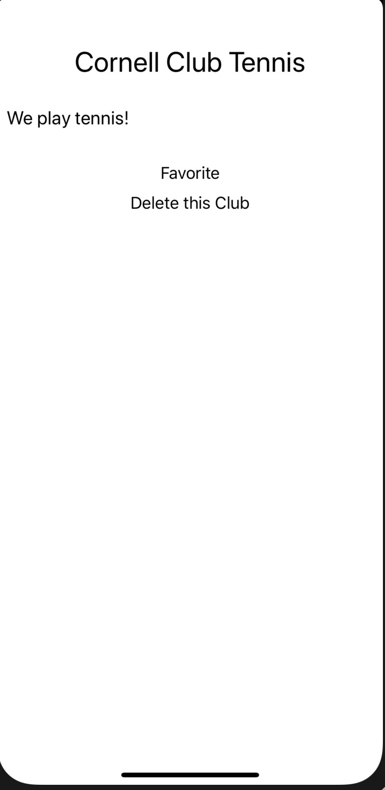
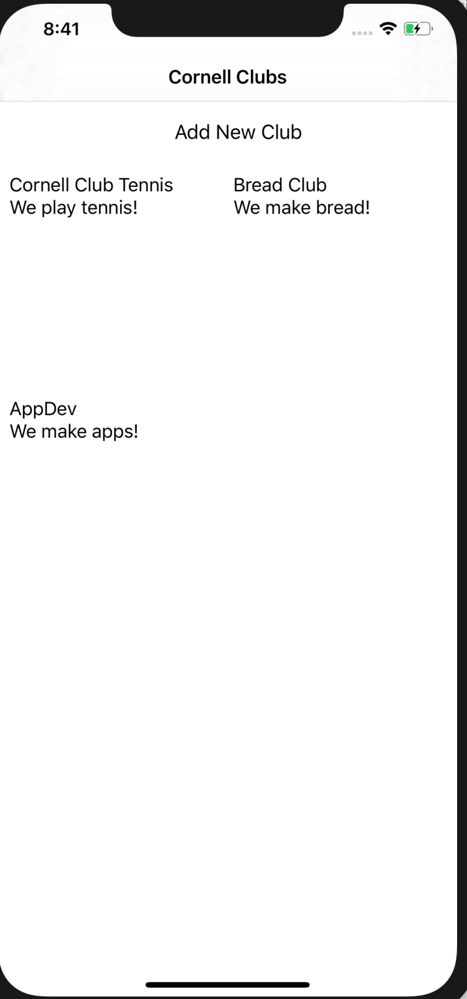

# cornell-clubs

App Name: Cornell Clubs
App Tagline: This app allows users to look at Cornell's clubs, add yourself to the listserv, favorite a club, add a club, and delete a club.
Link(s) to any other public GitHub repo(s) of your app: None
Some screenshots of your app (highlight important features)

A short description of your app (its purpose and features): Our app allows users to browse the various clubs at Cornell. You can add yourself to their listserv, create a new club for others to view and favorite, delete a club, and favorite a club for later. This app is useful because it gives an easier way for students to stay informed of their favorite organizations on campus.
A list of how your app addresses each of the requirements (iOS / Backend):
iOS: used AutoLayout using NSLayoutConstraint to make sure every UILabel, UIButton, etc was aligned correctly on the page and showed up where we wanted it to, used a UICollectionView to showcase the clubs with their descriptions, navigation is done through different view controllers that dismiss and present when told, and integration with API to ensure the clubs delete, add, and favorite when told and keep those preference even after the app has been closed.

Backend:
The backend has multiple routes, including get_clubs, assign_category, and add_member. The database has 4 classes: Club, Member, Category, and User. There are association tables between clubs and their members and clubs and their categories. The backend is deployed to Google Cloud.
Docker: https://hub.docker.com/r/mhb224/cornell_clubs
Google Cloud: http://35.227.43.197
